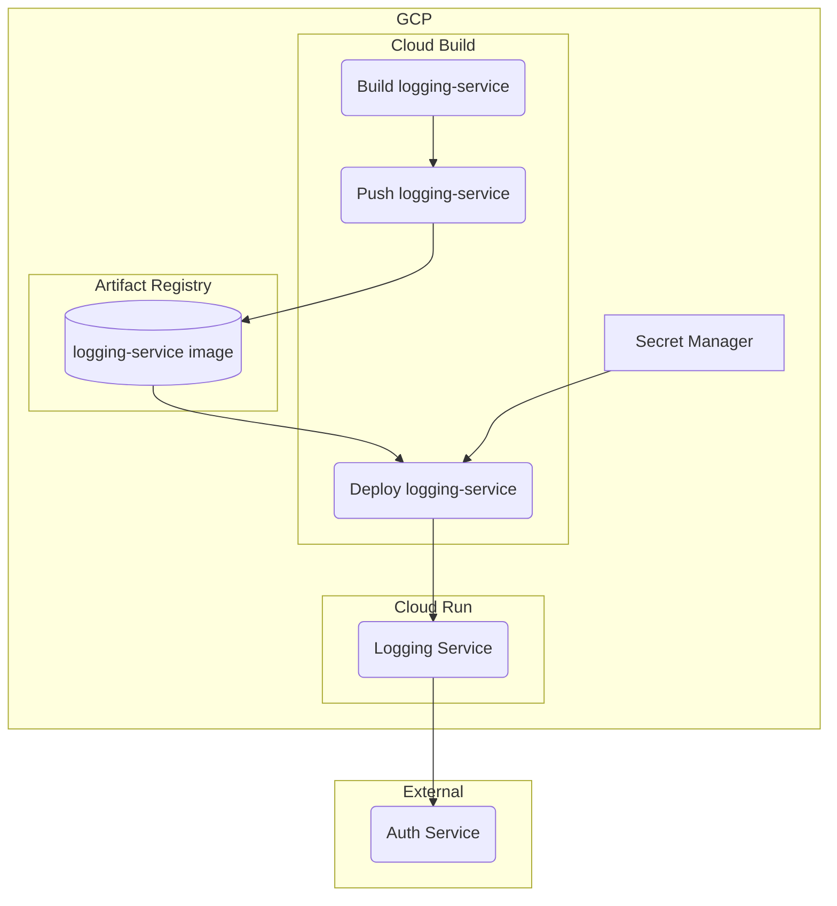

# Logging Service

- Microservices Architecture
- Clean Architecture
- Express
- Docker
- Test
- Codecov
- ESLint
- Prettier
- Cloud Build
- Cloud Run

```mermaid
flowchart TD
    subgraph gcp[GCP]
        secret_manager[Secret Manager]

        subgraph cloud_build[Cloud Build]
            build_logging_service(Build logging-service)
            push_logging_service(Push logging-service)
            deploy_logging_service(Deploy logging-service)
        end


        subgraph artifact_registry[Artifact Registry]
            logging_service_image[(logging-service image)]
        end

        subgraph cloud_run[Cloud Run]
            logging_service(Logging Service)
        end
    end

    subgraph external[External]
        auth_service(Auth Service)
    end

    build_logging_service --> push_logging_service --> logging_service_image

    logging_service_image --> deploy_logging_service --> logging_service

    secret_manager --> deploy_logging_service

    logging_service --> auth_service
```
